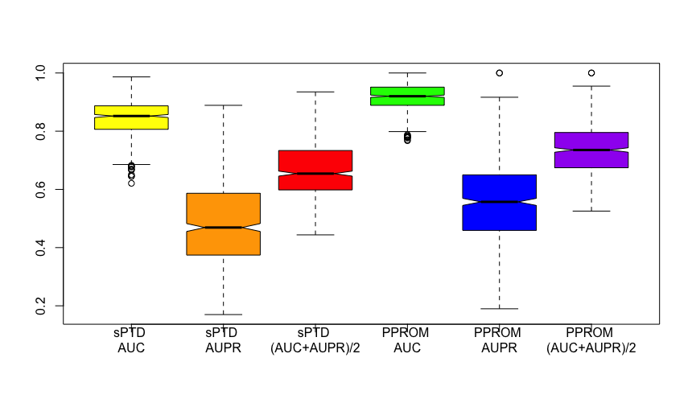

<h2> Writeup for DREAM Preterm Birth Prediction Challenge, Transcriptomics </h2>
<h4>Sub-challenge 2</h4>

Team: Team ZO
Author: Hannah Kim1)
Marija Stanojevic2)
Zoran Obradovic3)
**1) Bioinformatics Program, Temple University
**2) Computer and Information Sciences Department, Temple University

<h3> Summary </h3>

The classification tasks for Control vs sPTD and Control vs PPROM were done using denoising autoencoder for dimensionality reduction and using logistic regression and Support Vector Machine as the model.

<h3> Background/Introduction </h3>

The goal of the challenge is to correctly classify two preterm-birth diseases given the maternal whole blood transcriptomic data and gestational ages [1]. The training set consists of 435 samples (285 Control, 55 sPTD, and 95 PPROM) from 196 patients; and the test/validation set contains 304 samples from 87 patients. Given a transcriptome of 29459 genes, one restriction is to develop parsimonious models using less than 100 unique genes. Each team is allowed to make 2 submissions.

Our motivation for using neural network for dimensionality reduction comes from the complexity of the data. For the preliminary analysis, we visualized the data using the top 5000 genes with high variance and PCA. The goal was to qualitatively understand the data complexity and to see whether there were any underlying effects given three different sources and two different microarray platforms.

