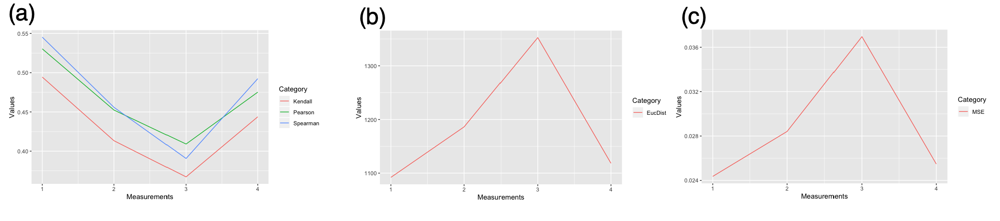

<h2> Writeup for DREAM Preterm Birth Prediction Challenge, Transcriptomics </h2>
<h4>Sub-challenge 2</h4>

Team: Team ZO
Authors: Hannah Kim1, Marija Stanojevic2, Zoran Obradovic2
1: Bioinformatics Program, Temple University
2: Computer and Information Sciences Department, Temple University

<h3> Summary </h3>

The classification tasks for Control vs sPTD and Control vs PPROM were done using denoising autoencoder for dimensionality reduction and using logistic regression and Support Vector Machine as the model.

<h3> Background/Introduction </h3>

The goal of the challenge is to correctly classify two preterm-birth diseases given the maternal whole blood transcriptomic data and gestational ages [1]. The training set consists of 435 samples (285 Control, 55 sPTD, and 95 PPROM) from 196 patients; and the test/validation set contains 304 samples from 87 patients. Given a transcriptome of 29459 genes, one restriction is to develop parsimonious models using less than 100 unique genes. Each team is allowed to make 2 submissions.

Our motivation for using neural network for dimensionality reduction comes from the complexity of the data. For the preliminary analysis, we visualized the data using the top 5000 genes with high variance and PCA. The goal was to qualitatively understand the data complexity and to see whether there were any underlying effects given three different sources and two different microarray platforms.

**Figure 1.** PCA plots with 5000 genes with top variance. For all plots, test/validation data were used for calculation but removed for visualization. (a) PCA plot colored by group (b) PCA plot colored by microarray platform (c) PCA plot colored by sources.

Figures 1b and 1c show that the data has not been dramatically affected by batch effects or platform differences. However, there were no visible clusters by groups either (Figure 1a). Because using PCA as a dimensionality reduction method did not give us useful information, we trained the autoencoder model to find the latent patterns.

We utilized logistic regression, SVM, and RF classifiers using the code layer of the autoencoder, because they are known to work well with continuous data.

<h3> Methods </h3>

We implemented our model using python and R packages, especially with Scikit-Learn and Keras [2][3]. We have submitted our source code Team\ ZO_script.py along with other dependent codes. Libraries and packages that we used can be found at the beginning of all scripts. Important version information can be found in Team\ ZO_info.txt.

We first obtained our genes of interest from a volcano plot by comparing the control and disease data [4]. We used the fold changes and p-values from Student's t-Test. We obtained 97 genes from Control vs sPTD (Figure 2 left) and 99 genes with Control vs PPROM (Figure 2 right) with this method.

**Figure 2.** Volcano plot showing genes that significantly distinguish Control and Disease (sPTD and PPROM). The left is from Control vs sPTD and the right is from Control vs PPROM. The genes colored in red were found by automatically applying thresholds and finding outliers based on the standard deviation.

Using the genes obtained from the volcano plot, we trained our denoising autoencoder. Because we are not looking at the labels yet, we trained our model using gene expression data from both training and test/validation sets to maximize the data utility. The activation function 'relu' and the optimization function 'adam' were used because they were generally considered the best for the unknown data. The parameters were tuned to optimize the model. The model was evaluated using Spearman correlation, Pearson correlation, Kendall correlation, Euclidean distance, and Mean Squared Error between the autoencoder predicted data and the original data. When tested with different parameters, the 7-layer autoencoder has the highest correlation, the lowest Euclidean distance, and the lowest mean squared error (Figure 3).

**Figure 3.** Autoencoder with different parameters. (x-axis) 1 indicates the result from 7-layer autoencoder; 2 indicates the result from 5-layer autoencoder; 3 indicates the result from 3-layer autoencoder; 4 indicates 1 with Noise=0.2. (a) Mean correlations by Spearman (blue), Pearson (green), Kendall (red) (b) Mean Euclidean distance (c) Averaged Mean Squared Error

Multiple classifiers were trained on the code layer from the autoencoder and the gestational ages with different parameters. Before making a prediction on the validation set, we evaluated modelslogistic regression, SVM, and RF classifiersusing 5-fold cross-validation. The training set had a mild skew in data labels of 285 Control : 55 sPTD : 95 PPROM, so we tested the data on both with the weights and without the weights as well. We did not get any outstanding AUC or AUPR improvement from the model with with weights. Instead, we consistently obtained AUPR lower than AUC in both Control vs sPTD and Control vs PPROM. This is expected to happen due to the imbalance in the data input.

**Figure 4.** Boxplots with results from 600 runs from our models The three plots on the left are AUC, AUPR, and the mean of the two from sPTD; the three plots on the right are AUC, AUPR, and the mean of the two from PPROM.
Because of the limitation of the TensorFlow package, it was impossible to obtain consistent results from our script. Thus, we decided to show what our models could achieve by running the experiment multiple times.

To show that our model can make a reasonable prediction, we ran our models 600 times and plotted our result (Figure 4). Our best models were trained via logistic regression and Support Vector Machine using rbf and linear kernels. Our average sPTD mean was 0.6 with AUC of 0.8 and AUPR of 0.4 (Figure 4). Our average PPROM mean was 0.7 with AUC of 0.9 and AUPR of 0.5 (Figure 4).

<h3> Conclusion/Discussion </h3>

In Team\ ZO_prediction.csv, we provided our validation prediction result from the models that give: sPTD AUC of 0.925, sPTD AUPR of 0.739, sPTD Mean of 0.832, PPROM AUC of 0.972, PPROM AUPR of 0.75, and PPROM Mean of 0.861. Initially, we expected Random Forest Classifier to produce the best result since it is the most complex model that uses an ensemble approach. However, our best classifiers were logistic regression and Support Vector Machine. Seeing this result, we conclude that the strength of our approach comes from the dimensionality reduction with denoising autoencoder. The code layer captures the essence of the significant genes so that the classifier training is improved.

<h3> References </h3>

[1] DREAM Preterm Birth Prediction Challenge, Transcriptomics Challenge (syn18380862)
[2] Pedregosa, F., Varoquaux, Ga"el, Gramfort, A., Michel, V., Thirion, B., Grisel, O., et al. others. "Scikit-learn: Machine learning in Python." Journal of Machine Learning Research, vol 12, 2011.
[3] Chollet, F. (2015) keras, GitHub. https://github.com/fchollet/keras
[4] Wei, Jin-Huan, et al. “A CpG-Methylation-Based Assay to Predict Survival in Clear Cell Renal Cell Carcinoma.” Nature Communications, vol. 6, no. 1, 2015, doi:10.1038/ncomms9699.

<h3> Authors Statement </h3>

H. K. obtained the dataset, did preliminary analysis of the dataset, and wrote the manuscript. M.S. and H. K. designed the general structure of the model. M. S. and H. K. optimized the model. M.S. and Z.O were supervising H.K. during the Fall 2019 when this project was done.
